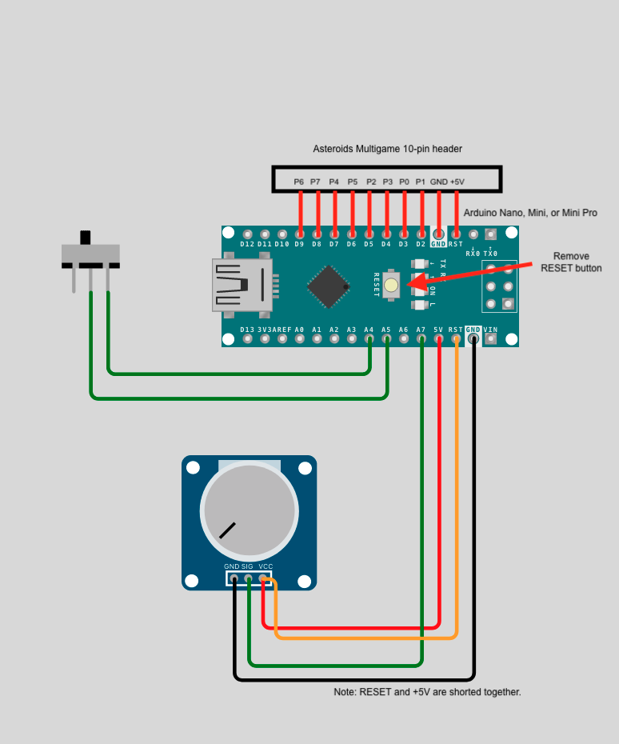

Lunar Lander thrust controller A/D adapter
==========================================

This project uses an Arduino nano or mini pro to interface a Lunar Lander thrust
contrller to the Asteroids multigame Created by Scott Brasington (`Braze Technologies <https://www.brasington.org/arcade/products/adl/>`__)

It turns out that the nano and mini have a pinout that can directly plug into
the 10-pin digital input connector on the Asteroids Multigame, so no special
adapter board or cable is needed. A cable is still needed for the potentiometer.

This adapter can work with almost any potentiometer value, and almost any
positioning of the potentiometer. The firmware will calibrate the analog values
read from the potentiometer and map those values to the recommended range of
values for the Lunar Landar game. To calibrate the thruster, simply short the
two "calibration" I/O pins momentarily, then move the thruster through its range
of motion. The highest and lowest values will automatically be stored in EEPROM,
and will be mapped to the expected high/low thruster values until another
calibration is performed, if ever. I suggest mounting a calibration switch near
the thruster, and connecting it to the calibration pins using a cable.

Because the nano and mini have the /RESET line where the multigame board
provides +5V, the /RESET line must be tied to the +5V line to ensure proper
operation. This is most easily done on the potentiometer cable, avoiding the
need for any board modifications. Note that the potentiometer cable cannot be
connected for in-circuit programming. For programming the nano over USB, the
cable can be left in place.

As a side note, since +5 and ~RESET are tied together when the potentiometer is
connected, it is a good idea to remove the RESET pushbutton, to avoid
accidentally shorting +5 to GND.

If the potentiometer cable is not installed, so that RESET is not connected to
+5V, then the device will still be powered through the protection diodes, and
the device will not be damaged.

Wiring:

The 10-pin header connects directly from Arduino nano (or mini) pins 3-12 to the
multigame 10-pin connector:

+---------------+--------------+
|  Arduino Pin  |Multigame Pin |
+===============+==============+
|   3 (RESET)   |   1 (+5V)    |
+---------------+--------------+
|    4 (GND)    |   2 (GND)    |
+---------------+--------------+
|    5 (D2)     |    3 (D1)    |
+---------------+--------------+
|    6 (D3)     |    4 (D0)    |
+---------------+--------------+
|    7 (D4)     |    6 (D3)    |
+---------------+--------------+
|    8 (D5)     |    7 (D2)    |
+---------------+--------------+
|    9 (D6)     |    8 (D5)    |
+---------------+--------------+
|    10 (D7)    |    8 (D4)    |
+---------------+--------------+
|    11 (D8)    |    9 (D7)    |
+---------------+--------------+
|    12 (D9)    |   10 (D6)    |
+---------------+--------------+

4-pin Potentiometer cable:

+------------+--------------+-------------------------------+
|Nano Pin    |Mini Pro Pin  |?Connected to:                 |
+============+--------------+===============================+
|A5          |A1            |Calibrate switch pin 1         |
+------------+--------------+-------------------------------+
|A6          |A2            |Calibrate switch pin 2         |
+------------+--------------+-------------------------------+
|A7          |A3            |Potentiometer wiper            |
+------------+--------------+-------------------------------+
|+5V         |+5V           |Potentiometer High side        |
+------------+--------------+-------------------------------+
|/RESET      |/RESET        |Potentiometer High side        |
+------------+--------------+-------------------------------+
|GND         |GND           |Potentiometer Low side         |
+------------+--------------+-------------------------------+

A simulation running the arduino software has been set up on Wokwi.com:

https://wokwi.com/arduino/projects/322006068604437075

